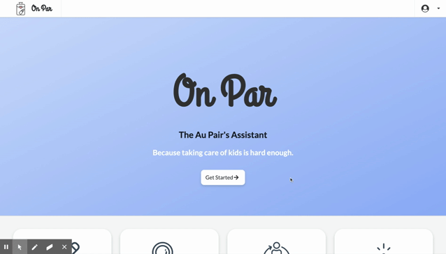
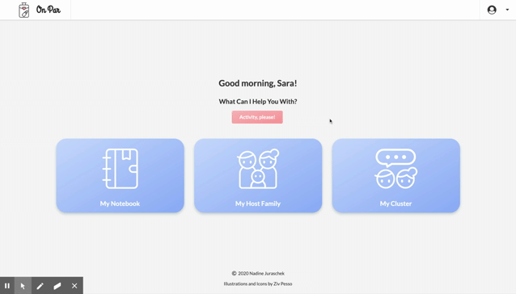
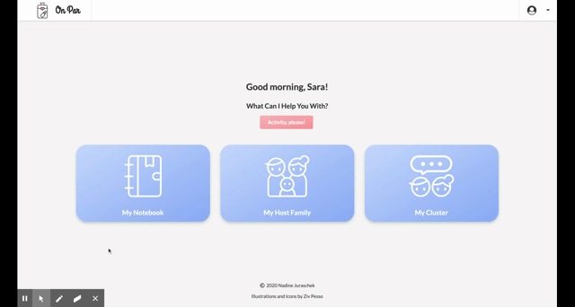
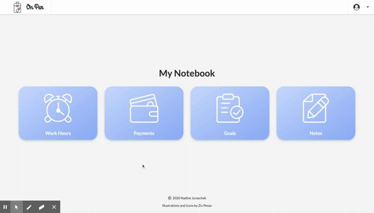
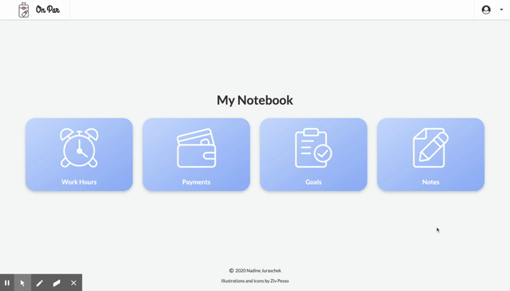

# On Par
## Au Pair Application
### UC Davis Coding Bootcamp - Project 3
#### https://au-pair-application.herokuapp.com/

#### Test Login
E-Mail: tester@mail.com
Password: testing123

## -- Currently in Development --

## Motivation

As a former Au Pair in America myself, I personally experienced the need for an au pair management application. To organize childcare schedules and activities, find emergency contact information, track workhours and payments, set personal goals, communicate with community counselors, host parents, etc. one needs to either use a variety of different apps or log everything in multiple notebooks. Having everything in one place would save a lot of time and might even eliminate miscommunication caused by language skills or cultural differences.

## What Is An Au Pair?
[Click here](https://www.aupairinamerica.com/aupairs/index.asp) to read about the Au Pair Program.

## What It Does

#### Authentication
Users can Register and Log In as an Au Pair. (Host Family and Community Counselor Log In coming soon!)

#### Chilcare Activity Suggestion
A quick suggestion for a fun activity to do with the kids.

### My Notebook
A personal tracker. Logs and saves...

#### Workhours 
These can be added weekly. A daily total needs to be entered and the app will then calculate a weekly total. If the hours exceed the 10 hours daily or 45 hours weekly maximum, the text or table cell will turn red.

#### Payments
Late or unpaid payments will be displayed in red.

#### Goals
Personal goals can be set for 3, 6, 9 or 12 months and can be categorized in personal, travel or educational goals.

#### Notes
A note section for reminders or comments.

## Technologies

* React.js
    * Context API
    * Hooks
* Semantic UI
* JavaScript
* Node.js
    * express
    * axios
    * bcryptjs
    * concurrently
    * cookie-parser
    * dotenv
    * jsonwebtoken
    * morgan
    * react-toastify
    * react-calendar
* MongoDB + mongoose

## Future Development Goals

#### Multiple User Options
* Au Pair
* Host Family Member
* Local Community Counselor

#### Tips, Resources, and Recommendations
* more activity suggestions
* tips for different host kid age groups
* communication starters for family-au pair communication
* goal suggestions for a successful au pair year
* family-au pair management tips
* How-Tos / Tutorials for getting a DL, SSN, etc.

#### Daily Journal
* shared journal to log kids' activities
* categories and icons for activities (food, school work, play, outside, ...)
* image upload
* 'like' button or comment section

#### Messaging
* personal messages
* auto-generated messages, e.g. when a payment is due or work hours limit is reached

#### Cluster Management
* list of au pairs in the cluster
* local education information and options
* monthly check ins
* cluster meeting dates
* contact to community counselor for emergencies

#### Host Family Info
* weekly schedule / calendar
* host parent work schedule
* au pair class schedule
* reminders
* helpful information about each host child
* host family house and car rules

#### Au Pair Goals
* list of things to accomplish within 3 - 6 - 9 - 12 months
